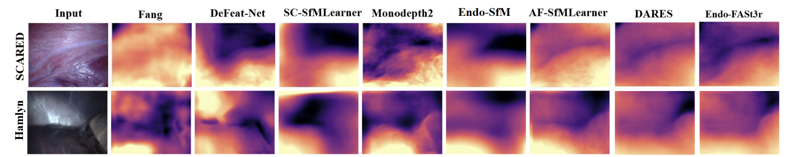
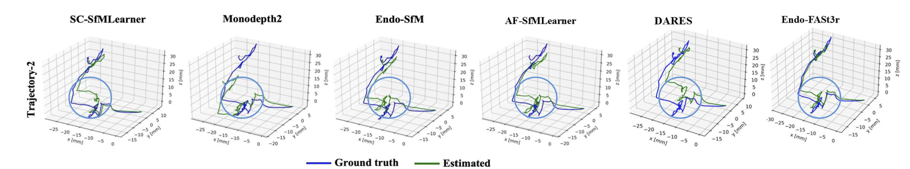
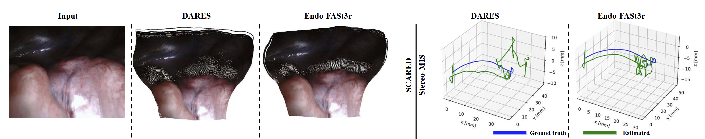

[comment]: <> (# [MICCAI2025] Endo-FASt3r: Endoscopic Foundation model Adaptation for Structure from motion)


  <p align="center">
  <h1 align="center">Endo-FASt3r: Endoscopic Foundation model Adaptation for Structure from motion</h1>
  <p align="center">
    <strong>Mona Sheikh Zeinoddin</strong>
    ·
    <strong>Mobarak I. Hoque</strong>
    ·
    <strong>Zafer Tandogdu</strong>
    ·
    <strong>Greg L. Shaw</strong>
    ·
    <strong>Matthew J. Clarkson</strong>
    ·
    <strong>Evangelos B. Mazomenos</strong>
    ·
    <strong>Danail Stoyanov</strong>
  </p>

[comment]: <> (  <h2 align="center">PAPER</h2>)
  <h3 align="center"><a href="https://arxiv.org/pdf/2503.07204v1">Paper</a> | <a href="https://youtu.be/0w4g5sY9y2k">Video</a></h3>
  <div align="center"></div>
  
<p align="center">
    
</p>
<br>


## ⚙️ Setup

We ran our experiments with PyTorch 2.1.0, CUDA 12.0, Python 3.10 and Ubuntu 22.04.


## 🖼️ Prediction for a single image or a folder of images

You can predict scaled disparity for a single image or a folder of images with:

```shell
CUDA_VISIBLE_DEVICES=0 python test_simple.py --model_path <your_model_path> --image_path <your_image_or_folder_path>
```

## Initializing with AF-Sfm Learner weights

You can download AF-Sfm Learners weights that we use in initialization with:

```shell
gdown 1kf7LjQ6a2ACKr6nX5Uyee3of3bXn1xWB
unzip -q Model_trained_end_to_end.zip
mv Model_trained_end_to_end af_sfmlearner_weights
```


## 💾 Datasets

You can download the [Endovis or SCARED dataset](https://endovissub2019-scared.grand-challenge.org) by signing the challenge rules and emailing them to max.allan@intusurg.com

**Endovis split**

The train/test/validation split for Endovis dataset used in our works is defined in the `splits/endovis` folder. 

**Endovis data preprocessing**

We use the ffmpeg to convert the RGB.mp4 into images.png:

```shell
find . -name "*.mp4" -print0 | xargs -0 -I {} sh -c 'output_dir=$(dirname "$1"); ffmpeg -i "$1" "$output_dir/%10d.png"' _ {}
```
We only use the left frames in our experiments and please refer to [extract_left_frames.py](https://github.com/ShuweiShao/AF-SfMLearner/blob/main/extract_left_frames.py). For dataset 8 and 9, we rephrase keyframes 0-4 as keyframes 1-5.

**Data structure**

The directory of dataset structure is shown as follows:

```
/path/to/endovis_data/
  dataset1/
    keyframe1/
      image_02/
        data/
          0000000001.png
```


## ⏳ Endovis training


```shell
CUDA_VISIBLE_DEVICES=0 python train_end_to_end.py --data_path <your_data_path> --log_dir <path_to_save_model (depth, pose, appearance flow, optical flow)>
```

## 📊 Endovis evaluation

To prepare the ground truth depth maps run:
```shell
CUDA_VISIBLE_DEVICES=0 python export_gt_depth.py --data_path <your_data_path> --split endovis
```
Depth Evaluation:
```shell
python evaluate_depth.py --data_path <your_data_path> --load_weights_folder <path_to_weights_i_folder> --eval_mono
```
Pose evaluation:
```shell
python evaluate_pose.py --data_path <your_data_path>  --load_weights_folder <path_to_weights_i_folder> --scared_pose_seq <trajectory_1_or_2>
```   

## Want to see our project in action? ✨ Dive into our interactive Colab demo: [Launch in Colab](https://colab.research.google.com/github/Mona-ShZeinoddin/Endo_FASt3r/blob/main/Endo_FASt3r_Demo.ipynb)

The **StereoMIS** sequence we used to evaluate our model is available [here](https://zenodo.org/records/16050206).


### Depth Estimation on SCARED & Hamlyn

<p align="center">
 
</p>

### Visual Odometry on SCARED Trajectory2

<p align="center">
 
</p>

### 3D Reconstruction on SCARED & Visual Odometry on StereoMIS

<p align="center">
 
</p>


## Our Model

| Model        | Abs Rel | Sq Rel | RMSE | ATE-Trajectory 1 | ATE-Trajectory 2 |Link |
| ------------ | ---------- | ------ | --------- | ---- | ---- | ---- |
| End-to-end best model weights | 0.051 | 0.354 | 4.480 | 0.0702 | 0.0438 |[google](https://drive.google.com/file/d/18OWwl7nptKwdYSGIYV-nOGwrv-aPsO6o/view?usp=sharing)|


# Citation
If you found this code/work to be useful in your own research, please considering citing the following:

```bibtex
  @article{zeinoddin2025endo,
  title={Endo-FASt3r: Endoscopic Foundation model Adaptation for Structure from motion},
  author={Zeinoddin, Mona Sheikh and Islam, Mobarakol and Tandogdu, Zafer and Shaw, Greg and Clarkson, Mathew J and Mazomenos, Evangelos and Stoyanov, Danail},
  booktitle={International Conference on Medical Image Computing and Computer-Assisted Intervention},
  year={2025},
  organization={Springer}
} 
```

## Contact

If you have any questions, please feel free to contact mona.zeinoddin.22@ucl.ac.uk

 
